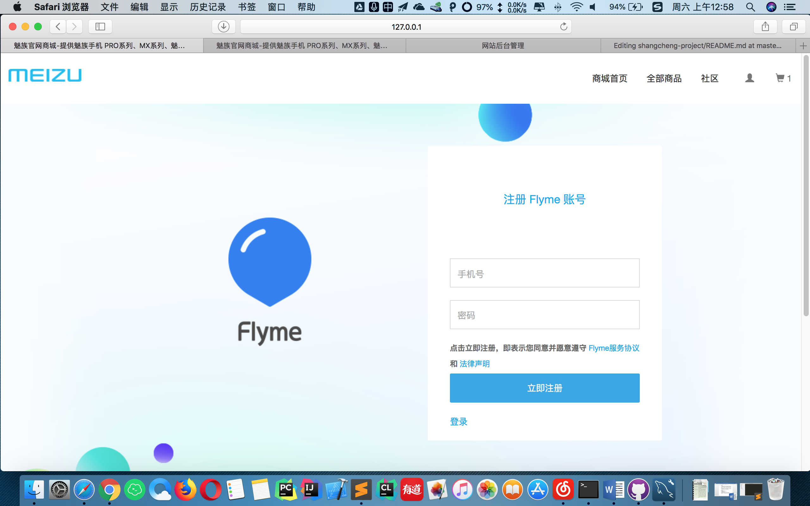
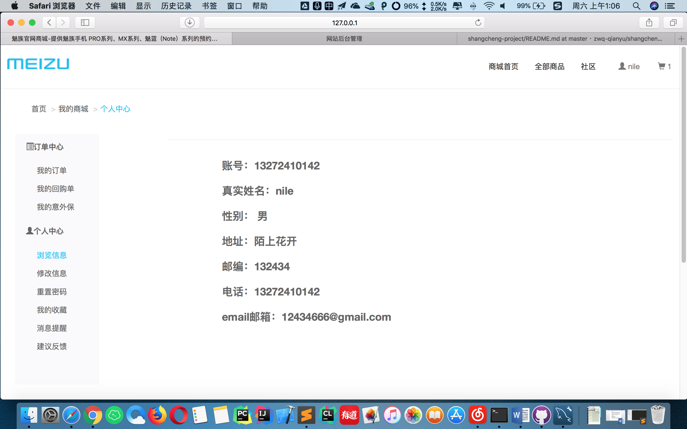
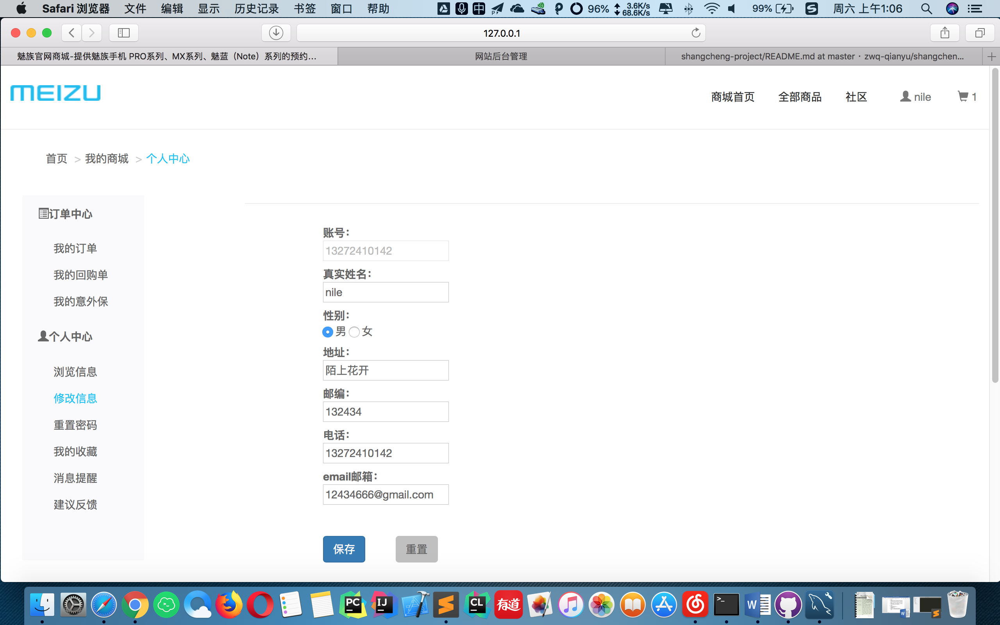
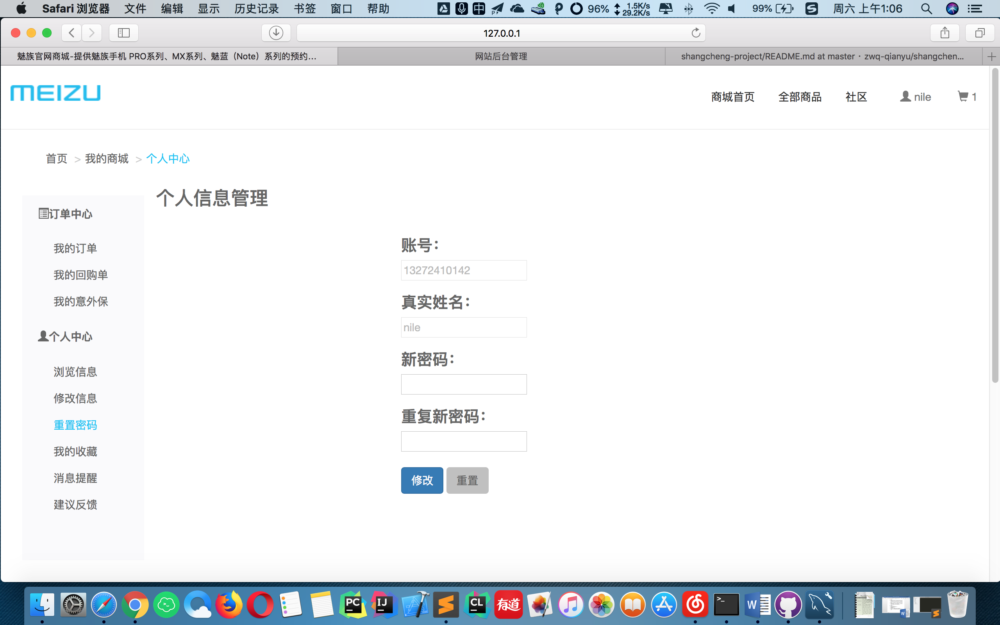
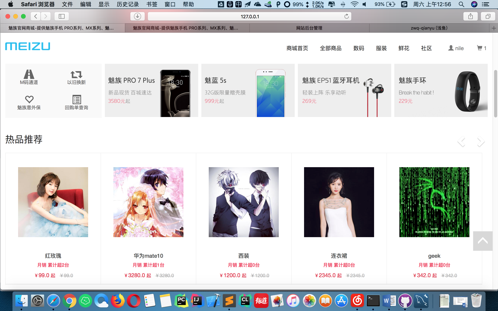
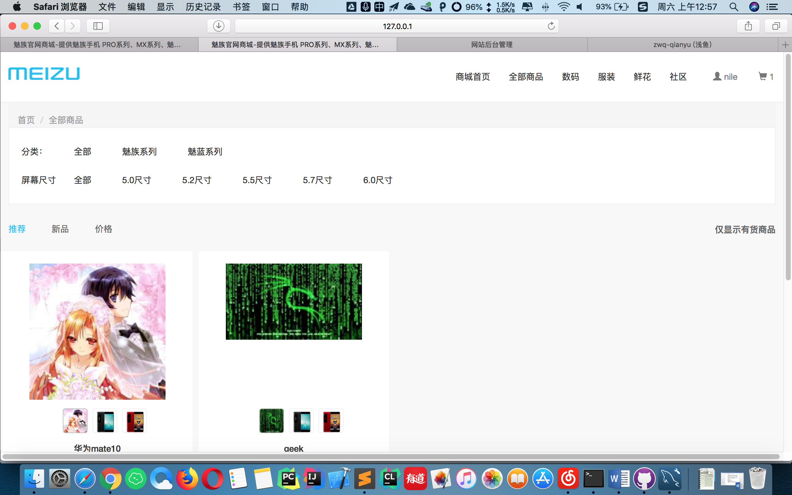
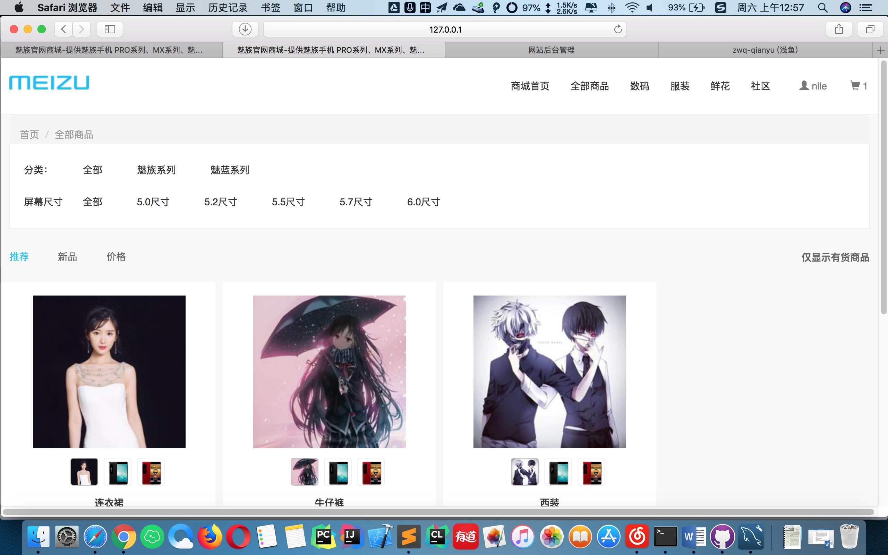
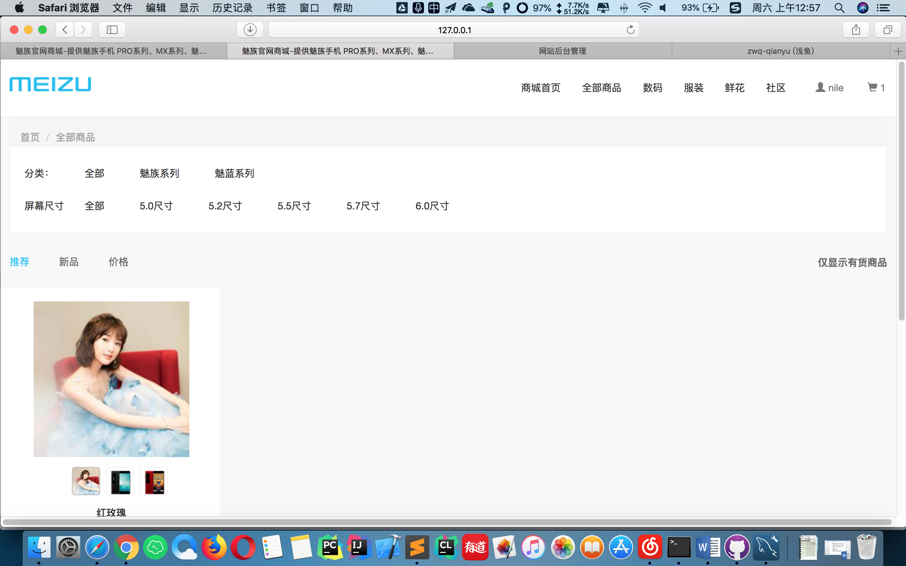
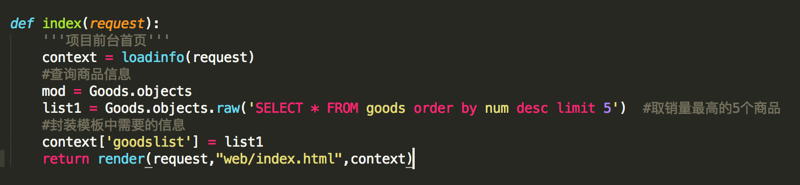

# myproject
内容请以`web-branch`中的为准，使用时请先将shopdb.sql文件导入到数据库中再使用。
  
该项目完整压缩包请到下面的网址下载：
https://share.runtofuture.cn/zwq-projects/
  
下面是2018年4月28日提交时新添加的功能：

 
<h2>a) 会员前台注册，如图：</h2>
</img>

  
<h2>b) 会员中心的个人信息浏览和编辑:</h2>
</img>
</img>

  
<h2>c) 会员重置密码:</h2>
</img>

  
<h2>d）商城首页商品展示:（主页商品按照月销量降序排列，数码、服装和鲜花类别的商品获取所有相应类别的商品进行显示）</h2>
</img>
</img>
</img>
</img>
 
<h3>实现原理代码图示：</h3>
</img>

  
<h3>
扩展功能： 
1、注册、登录页面相互跳转； 
2、添加info.html页面，用于出错时显示提示； 
3、成功修改密码后跳转到登录页面； 
4、浏览和编辑功能分开。 
</h3>
